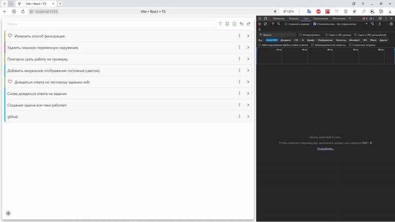
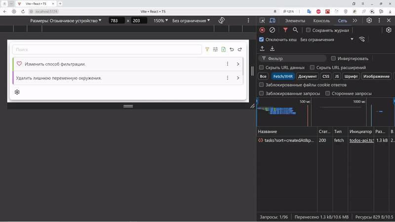

## Создание задачи (работает)

## Проверка Infinite scroll (работает)
Данные получаю не одним запросом, а несколькими, только в том случае, если последний элемент попадает во viewport

## Запуск
`npm start`

Задание
- [x] Добавление задачи
- [x] Удаление задачи
  - [x] Множественное удаление задач
- [x] Получение списка всех задач
- [x] Изменение статуса задачи
  - [x] Множественно изменение статуса
  - [x] Изменение статуса вне диалогового окна
- [x] Infinite scroll
- [x] Добавление задач в избранное с сохранением состояния
- [x] Фильтрация задач по "Все", "Выполненные", "Не выполненные", "Избранное"

- [x] Сохранение состояния приложения
- [x] Добавление Error Boundaries

Что реализовано
- [x] "Универсальное" переиспользуемое диалоговое окно 
- [x] Контекстное меню, меняющее свое положение в зависимости от наличия/отсутствия свободного места
- [x] Confirmation окно для подтверждения действия с возможностью управления клавишами (Esc, Enter)
- [x] Хранение параметров поиска и фильтрации в URL строке, с синхранизацией при использовании navigation.go(-1) и navigation.go(1)